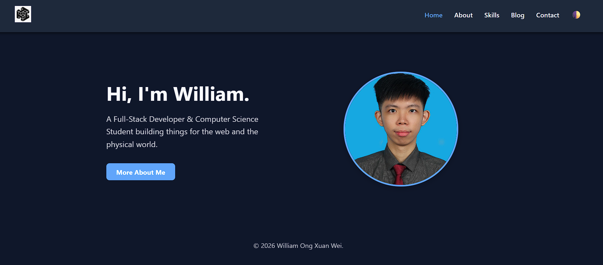
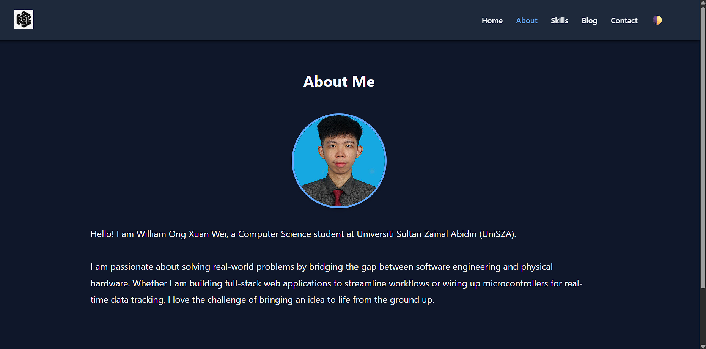
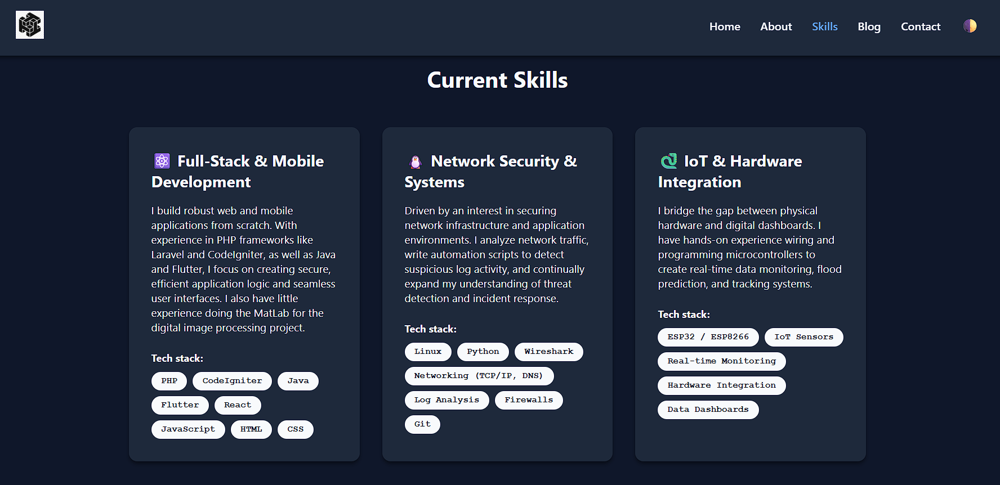
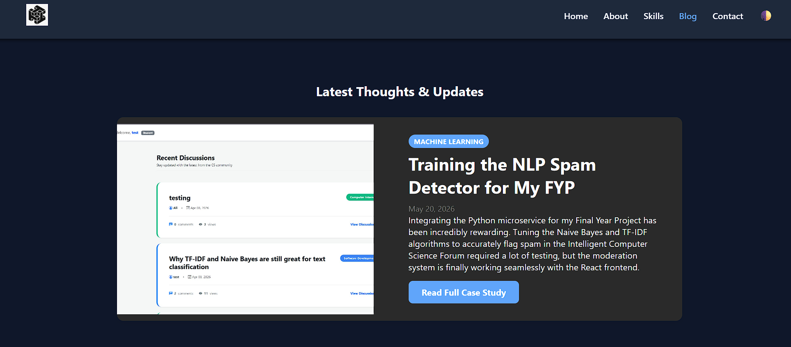
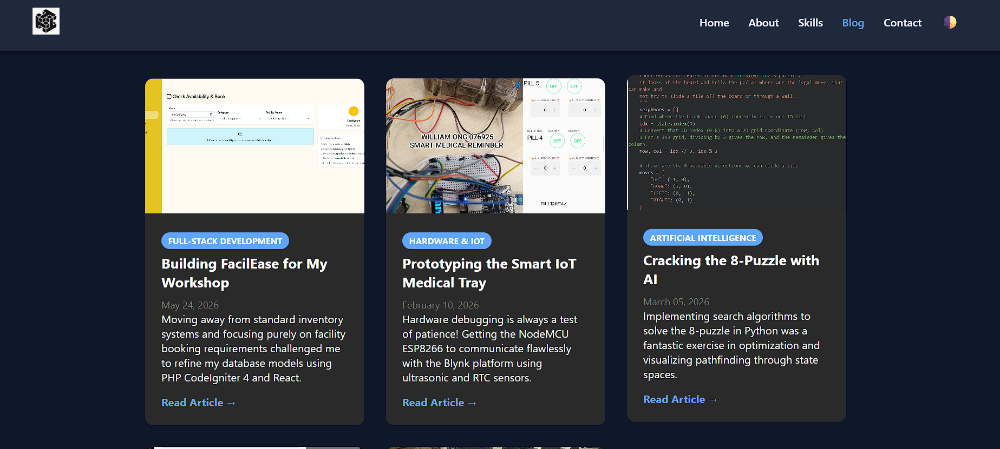
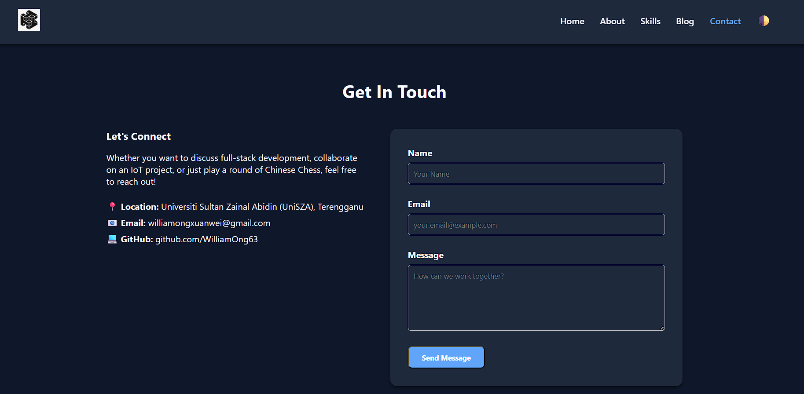

# Personal GitHub Portfolio

## Description

A modern, responsive personal e-portfolio website designed to showcase my software development projects, technical skills, and academic background as a Computer Science student at Universiti Sultan Zainal Abidin (UniSZA). This project was developed for the CSD 34203 Special Topics in Software Development course to demonstrate an entrepreneurial mindset through project execution and proper version control documentation.

## Features

- **Modern UI/UX:** Clean, professional grid-based layout.
- **Responsive Design:** Fully accessible and optimized for both desktop and mobile viewing. 
- **Dark/Light Mode:** Interactive JavaScript toggle allowing users to switch interface themes.
- **Project Showcase:** Dedicated sections highlighting full-stack development, IoT hardware, and digital transformation projects.
- **Multi-Page Structure:** Includes Home, About, Blog, and Contact pages.

## Technologies Used

- **HTML5:** Semantic page structuring.
- **CSS3:** Custom styling featuring CSS Variables, Flexbox, and CSS Grid (No external CSS frameworks used).
- **JavaScript (Vanilla):** DOM manipulation for the dynamic theme toggle.
- **Git & GitHub:** Version control and repository management.

## Screenshots

- **Home Page**
<div align="center">
  
  
</div>

- **About Page**
<div align="center">
  
</div>

- **Skill Page**
<div align="center">
  
</div>

- **Blog Page** 
<div align="center">
  
  
</div>

- **Contact Page**
<div align="center">
  
</div>

## How to Run the Project

1. **Clone the repository:**
   ```bash
   git clone [https://github.com/WilliamOng63/portfolio.git](https://github.com/WilliamOng63/portfolio.git)
   ```

## Live Demo

Check out the live website here:

```bash
[View My E-Portfolio]([https://williamong63.github.io/portfolio/](https://williamong63.github.io/portfolio2/)) 
```
